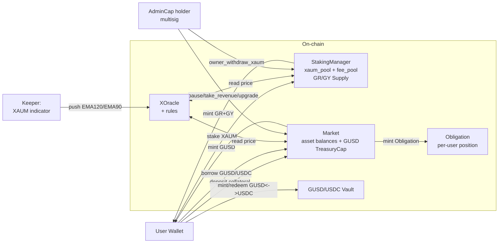

# Creek Protocol — Architecture & Privilege Map

Source of truth for the audit. Update whenever a module is added/removed or a
privileged surface changes. Public mainnet object IDs live in
`scripts/deploy/mainnet/*.json` — load on demand.

## High-level Modules

```
contracts/
├── protocol/                        # Borrowing market, GUSD vault, staking
│   ├── app/                         #   Admin entry (AdminCap-gated)
│   ├── market/                      #   Pool state, limiter, interest/risk model
│   ├── obligation/                  #   User position objects
│   ├── user/                        #   borrow/repay/deposit/withdraw/liquidate/flash_loan
│   │   └── gusd_usdc_vault.move    #   GUSD<->USDC vault
│   ├── evaluator/                   #   Health factor, liquidation math, price aggregator
│   ├── staking/                     #   StakingManager: XAUM -> GR + GY
│   ├── version/                     #   Versioned-object pattern
│   └── error/                       #   Error codes
├── coins/
│   ├── coin_gr/                     #   GR — gold-reserve token, DenyList
│   ├── coin_gy/                     #   GY — gold-yield token, DenyList
│   └── coin_gusd/                   #   GUSD — stablecoin, DenyList
├── sui_x_oracle/
│   ├── x_oracle/                    #   Aggregator + admin caps
│   ├── pyth_rule/                   #   Pyth adaptor
│   ├── manual_rule/                 #   Test-only manual prices
│   ├── gr_rule/                     #   GR derived price rule
│   ├── gusd_rule/                   #   GUSD price rule
│   ├── supra_rule/                  #   Supra adaptor
│   └── switchboard_on_demand_rule/  #   Switchboard adaptor
├── xaum_indicator/
│   ├── core/                        #   PriceStorage (admin-gated mutators) + EMA push to XOracle
│   └── pyth_adapter/                #   Pyth -> indicator
└── libs/
    ├── math/                        #   FixedPoint32 helpers, u64/u128/u256 mul_div
    ├── x/                           #   ac_table, wit_table, one_time_lock_value, witness, balance_bag
    └── coin_decimals_registry/
```

## Money Flow Summary



## Privileged Capabilities Inventory

Use this table to map every finding to its trust assumption.

| Capability | Defined in | Holder (mainnet) | What it can do | Notes |
|---|---|---|---|---|
| `protocol::app::AdminCap` | `app.move` L29 | multisig | pause/resume, take_revenue, take_borrow_fee, take_staking_fee, owner_withdraw/deposit_xaum, set risk/interest/limiter (timelocked), update_borrow_fee/limit, set_gusd_cap, update_reward_address, transfer_admin_cap, set_flash_loan_single_cap | `interest_model_cap` + `risk_model_cap` embedded inside; **`transfer_admin_cap` exists — single signature can move it** |
| `protocol::version::VersionCap` | `version.move` L11 | multisig | bump version (forces migration) | Separate from AdminCap |
| `StakingManager.admin` (address field) | `staking_manager.move` L27 | deployer at init | `update_stake_fee`, `update_unstake_fee`, `update_stake_cap` (via `public(package)` guarded by `sender == admin`) | **DUAL ADMIN MODEL** — different from AdminCap path; check for divergence |
| `x_oracle::XOracleAdminCap` | `x_oracle.move` | multisig + keeper-bound copy | set GR indicators, GR alpha/beta, GR/XAUM coin type, price feeds | Minted in `init`; another copy bound into `xaum_indicator_core::PriceStorage` as a dynamic field for keeper EMA pushes |
| `x_oracle::XOracleOwnerCap` | `x_oracle.move` | multisig | mint extra AdminCap, transfer ownership | Higher than admin |
| `xaum_indicator_core::AdminCap` | `xaum_indicator_core.move` L34 | keeper wallet (`XAUM_INDICATOR_UPDATE_WALLET_ADDRESS`) | push EMA120/EMA90, configure feed | **Hot wallet — private key on server** |
| `xaum_indicator_core::OwnerCap` | `xaum_indicator_core.move` | multisig | rotate AdminCap, override admin |  |
| `pyth_rule::PythRegistryCap` | `pyth_registry.move` | multisig | register/unregister price feeds |  |
| `coin_*::DenyCapV2` | `coin_gr/gy/gusd.move` | multisig | add/remove address from DenyList | Per coin |
| `coin_*::MetadataCap` | `coin_gr/gy/gusd.move` | multisig | edit token metadata | Per coin |
| GR/GY `Supply<T>` | inside `StakingManager` | StakingManager only | mint/burn | TreasuryCap was consumed into Supply at init — irreversible |
| GUSD `TreasuryCap<COIN_GUSD>` | stored in `Market` | Market only (via `set_gusd_cap`) | mint GUSD | Borrow path mints; repay path burns |
| `Sui::package::UpgradeCap` (one per package) | created by Sui at publish | multisig | upgrade package code | Per-package; **single point of failure if any one slips** |

## Critical State Containers

| Object | Type | Custody | Comment |
|---|---|---|---|
| `Market` (shared) | `protocol::market::Market` | shared object | holds borrow/collateral balances via `balance_bag`, plus GUSD TreasuryCap |
| `StakingManager` (shared) | `protocol::staking_manager::StakingManager` | shared object | holds `xaum_pool`, `xaum_fee_pool`, `gr_supply`, `gy_supply` |
| `Obligation` (owned by user) | `protocol::obligation::Obligation` | user-owned | per-user debts + collaterals |
| `XOracle` (shared) | `x_oracle::XOracle` | shared object | price feeds, GR pricing config |
| `PriceStorage` (shared) | `xaum_indicator_core::PriceStorage` | shared object | Holds XAUM spot + EMA120/EMA90/EMA5 state. All mutators require `&AdminCap` and `assert_current_version(storage)`. The single write entrypoint reachable from outside the module is `update_price_storage_admin(storage, admin_cap, price)`. `push_gr_indicators_to_x_oracle` asserts `spot_u64 > 0` (`E_INVALID_SPOT`). Keeper drives via adapter `update_xaum_price`. |
| `Version` (shared) | `protocol::version::Version` | shared object | global protocol version |

## Constants & Magic Numbers

| Constant | Value | Location |
|---|---|---|
| `MIN_STAKE_AMOUNT` | `1_000_000` (0.001 XAUM) | `staking_manager.move` L19 |
| `EXCHANGE_RATE` | `100` (1 XAUM → 100 GR + 100 GY) | `staking_manager.move` L22 |
| Default auto-pause threshold | `8/100` (GUSD depeg tolerance 8%) | `market.move` L131 |
| `LimiterUpdateChangeEffectiveEpoches` | `7` | `limiter.move` L9 |
| Liquidation cap divisor | check `liquidation_evaluator.move` | derived from Scallop heritage |

## Pause Surface

| Function | Has pause check? | Has version check? | Note |
|---|---|---|---|
| `deposit_collateral` | YES | (verify) |  |
| `withdraw_collateral` | YES (L48, L88) | (verify) |  |
| `borrow` | YES (L52, L94) | (verify) |  |
| `repay` | YES (L44) | (verify) |  |
| `flash_loan` (borrow + repay) | YES (L42, L101) | (verify) |  |
| `liquidate` | (verify) | (verify) | check |
| `gusd_usdc_vault::mint/redeem` | YES (E_IS_PAUSED L97, L129) | (verify) |  |
| `stake_xaum` | **NO** | YES | **gap — confirmed in earlier reading** |
| `unstake` | **NO** | YES | **gap** |
| `take_revenue` / `take_borrow_fee` / `take_staking_fee` | **NO** | (verify) | admin-gated but could fire during pause |
| `owner_withdraw_xaum` / `owner_deposit_xaum` | **NO** | (verify) | admin-gated |
| `pause_protocol` / `resume_protocol` | n/a | **NO** | should require Version? |
| `check_and_pause_if_gusd_depeg` | n/a — only flips paused=true | (verify) | permissionless; no rate limit on calls |
| `set_auto_pause_*` | n/a | (verify) | admin-gated |

## Known Design Choices (do not flag as bugs)

- **Owned `Obligation`** — per-user owned object; only owner can pass it as input.
- **`OneTimeLockValue` timelock** — interest/risk/limiter changes require an epoch delay before apply.
- **Soft liquidation** — only a fraction of debt can be repaid per call (Scallop heritage).
- **GR/GY Supply held inside StakingManager** — TreasuryCap was consumed at init; not recoverable.
- **GUSD TreasuryCap held inside Market** — Market mints GUSD as part of borrow.
- **Two-track admin** for staking — `AdminCap` for revenue & owner withdraw, `StakingManager.admin` address for fee rate. **Document this clearly; do not double-flag, but DO check both paths cannot diverge.**

## Off-chain Trust Boundary (not in code scope, but inform findings)

- `XAUM_INDICATOR_UPDATE_PRIVATE_KEY` (in `backend/server/src/services/chain/xaumIndicatorService.js`) → can push EMA values via bound XOracleAdminCap. Compromise = oracle manipulation.
- `DISDISTRIBUTE_STAKING_REWARDS_PRIVATE_KEY` (in `stakingContractService.js`) → keeper for rewards distribution.
- Multisig threshold/composition is operational, not in Move scope.
- `check_and_pause_if_gusd_depeg` needs an external keeper to call it; not enforced on-chain.
- **GUSD price monitor** — during the launch-phase period where `gusd_rule` writes a constant $1, the on-chain `check_and_pause_if_gusd_depeg` is inert. Off-chain backend MUST monitor real GUSD market price (CEX, DEX TWAP, or external Pyth GUSD/USD feed if available) and trigger manual `pause_protocol` via admin multisig on depeg detection. This is a transitional state with a documented migration path (swap `gusd_rule` → external oracle rule when GUSD has tradable market depth).
- **`xaum_indicator_core` deploy SOP** — `init_ema_values` is one-shot (`assert!(!ema_initialized)`). Deploy script must invoke `init_ema_values` atomically (or as close to publish as practical). Compromise contingency: abandon the deployment and redeploy with fresh package IDs. This SOP makes init-time front-running an operational concern, not an architectural defect.
